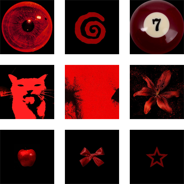

	

  

  <h1>KhaDinh1702</h1>
  <h3>NodeJS Developer | Full-stack Learner</h3>
  

    
  

---

### Languages

  
  
  
  
  

### Tech Stack

  <!-- Languages / Frameworks -->
  
  
  
  
  
   
  <!-- Database & Cloud -->
  
  
  
  
   
  <!-- Tools & Payments -->
  
  
  
  
  
  
  
  

## Featured Projects

<table>
  <tr>
    <td width="48" align="center" valign="middle">
      
    </td>
    <td valign="middle">
      <strong>Questly</strong>
       
      <strong>Release soon</strong> - A project currently in progress.
    </td>
  </tr>
</table>

## GitHub Stats

## Contribution Snake

